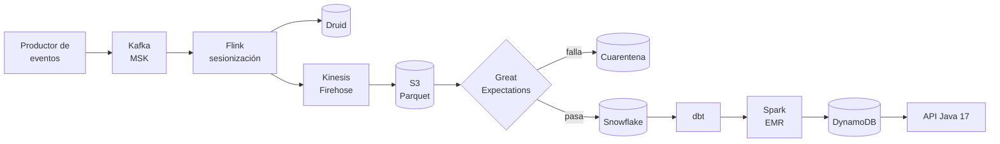
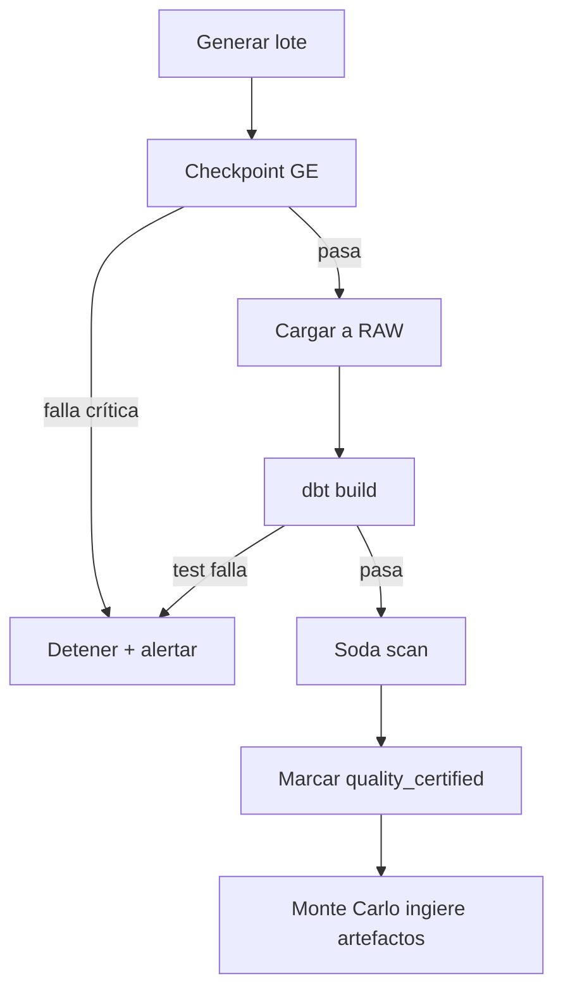
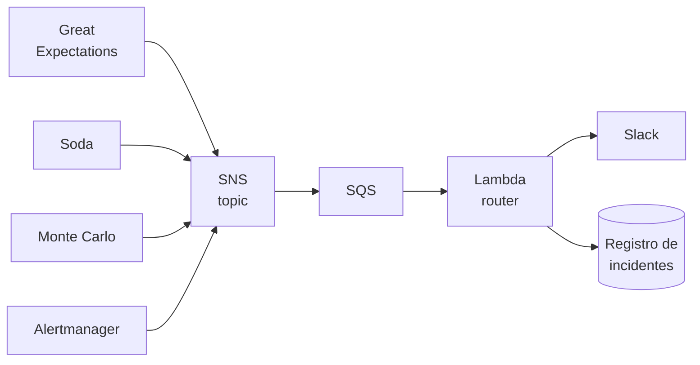

# Music Data Reliability

> Prototipo de **Data Reliability** y **Data Observability** sobre un sistema de análisis de preferencias musicales.

[](https://www.python.org/)
[](https://openjdk.org/projects/jdk/17/)
[](https://www.getdbt.com/)
[](LICENSE)

Cuatro capas de control independientes —contratos, transformación, SLOs y observabilidad— protegen la confiabilidad de un dataset de features musicales destinado a alimentar un motor de recomendación. El proyecto demuestra, con evidencia medida, que ninguna de las cuatro es redundante.

---

## Tabla de contenidos

- [Por qué](#por-qué)
- [Arquitectura](#arquitectura)
- [Stack](#stack)
- [Separación de responsabilidades](#separación-de-responsabilidades)
- [Requisitos previos](#requisitos-previos)
- [Instalación](#instalación)
- [Configuración](#configuración)
- [Uso](#uso)
- [Modelo de datos](#modelo-de-datos)
- [Capas de datos](#capas-de-datos)
- [Experimento de anomalías](#experimento-de-anomalías)
- [API de features](#api-de-features)
- [Observabilidad](#observabilidad)
- [Estructura del repositorio](#estructura-del-repositorio)
- [Tests](#tests)
- [Problemas frecuentes](#problemas-frecuentes)
- [Alcance](#alcance)

---

## Por qué

Un sistema de preferencias musicales no le pregunta al usuario qué le gusta: lo infiere de su comportamiento. No hay calificaciones explícitas contra las cuales contrastar, así que **un evento corrupto no es un registro perdido, es una opinión falsificada atribuida a una persona real**.

Cada falla de datos tiene una traducción directa al producto:

| Falla en los datos | Consecuencia en el producto |
| --- | --- |
| Se pierden eventos `skip` | Desaparece la señal negativa; el sistema cree que al usuario le gusta todo |
| `ms_played` inflado un 25% | Afinidades sobreestimadas; recomendaciones genéricas |
| Cae el volumen de un país | Peores recomendaciones para usuarios que no hicieron nada mal |
| Retraso de carga de 10 horas | El perfil refleja al usuario de ayer, no al de hoy |
| Usuarios sin eventos suficientes | Arranque en frío permanente y probable abandono |

Ninguna de estas filas produce un error, una excepción ni un valor nulo. El pipeline corre en verde y entrega un dataset de aspecto impecable. Peor aún: en un recomendador el error se realimenta —lo mal recomendado hoy es lo escuchado mañana— y para cuando aparece en las métricas de negocio el historial ya está contaminado.

De ahí el diseño: **hacen falta controles determinísticos y controles de comportamiento, porque cada familia es ciega a lo que detecta la otra.**

---

## Arquitectura



El checkpoint de Great Expectations lo dispara una Lambda suscrita a `s3:ObjectCreated` sobre la zona `raw/`: la validación ocurre sobre el archivo recién aterrizado, antes de que Snowflake lo vea y sin polling.

### Dos velocidades sobre la misma fuente

|  | Camino rápido | Camino analítico |
| --- | --- | --- |
| Recorrido | Kafka → Flink → Druid | Kafka → Flink → S3 → Snowflake → dbt |
| Latencia | Segundos | Horas |
| Validación | Ninguna previa | GE, dbt tests, Soda |
| Uso | Monitoreo operativo | Features certificadas |
| Confiabilidad | Best effort | Contractual |

Ninguna feature de preferencia se calcula sobre datos que no pasaron por el camino analítico. Druid puede mostrar un skip rate erróneo durante diez minutos sin afectar a un solo usuario; `user_listening_features` no puede.

---

## Stack

| Capa | Tecnologías |
| --- | --- |
| Streaming | Kafka (MSK), Apache Flink, Kinesis Firehose |
| Almacenamiento | S3, Snowflake, Athena, DynamoDB, Druid, Redis (ElastiCache) |
| Procesamiento | Python 3.11, Spark (EMR), dbt 1.8 |
| Serving | Java 17, Spring Boot 3, API Gateway, Cognito (OAuth2) |
| Plataforma | Docker, Kubernetes (EKS), Lambda, SNS/SQS, CloudTrail |
| Calidad de datos | Great Expectations, dbt tests, Soda Core |
| Observabilidad | Monte Carlo, Prometheus, Grafana, ELK/OpenSearch |

<details>
<summary><strong>Alternativas evaluadas y descartadas</strong></summary>

- **SingleStore** — su nicho HTAP ya lo cubren Druid (analítica en tiempo real) y DynamoDB (lectura por clave). Sería una cuarta base de datos sin una pregunta propia que responder.
- **Memcached** — Redis resuelve el mismo caso con estructuras de datos más ricas y persistencia opcional. Dos cachés en el mismo sistema exigiría una justificación que no existe.
- **BigQuery / Pub/Sub** — reservados para una fase opcional con propósito propio: replicar `fct_listening_events` y correr allí la misma suite de GE y Soda, para verificar si el contrato de datos es portable entre warehouses. Las divergencias (tipos, nulos, zonas horarias) serían el hallazgo.
- **Airflow / Dagster** — a esta escala, cron o GitHub Actions bastan. Sumarían operación sin demostrar nada sobre confiabilidad.

</details>

---

## Separación de responsabilidades

Las cuatro herramientas de calidad pueden chequear nulos y unicidad. Si no se asignan responsabilidades explícitas, el stack se vuelve redundante y no demuestra nada. La regla es: **cada control vive donde su falla tiene la consecuencia correcta.**

| Herramienta | Pregunta que responde | Capa | Naturaleza | Ante falla |
| --- | --- | --- | --- | --- |
| Great Expectations | ¿El dato entrante cumple el contrato? | Pre-`RAW` | Determinística | Bloquea la carga |
| dbt tests | ¿El modelo es estructuralmente coherente? | `STAGING`, `CORE` | Determinística | Falla el build |
| Soda | ¿El dataset cumple su SLO? | `CORE`, `MARTS` | Umbral declarado | Alerta |
| Monte Carlo | ¿El dato se comporta como siempre? | Todas | Estadística, aprendida | Alerta con lineage |

**Reglas de no-duplicación:**

1. Un chequeo de `not_null` se declara una sola vez, en la capa donde primero es exigible.
2. Great Expectations no valida tablas transformadas; su dominio termina en `RAW`.
3. Soda no reimplementa tests estructurales de dbt; opera sobre umbrales porcentuales y temporales.
4. Monte Carlo no recibe reglas que ya existan como test determinístico.

---

## Requisitos previos

| Requisito | Versión mínima | Notas |
| --- | --- | --- |
| Docker + Docker Compose | 24.0 / v2 | Levanta Kafka, Flink, Druid, Redis, LocalStack |
| Python | 3.11 | Generador, GE, Soda, orquestación |
| Java JDK | 17 | API de features |
| Make | 4.0 | Punto de entrada de todos los comandos |
| Cuenta Snowflake | Trial alcanza | **Único servicio remoto requerido** |
| Cuenta Monte Carlo | — | Opcional; sin ella el pipeline corre con 3 capas |

Recursos recomendados para el entorno local: 8 GB de RAM libres y 20 GB de disco.

---

## Instalación

```bash
git clone https://github.com/<org>/music-data-reliability.git
cd music-data-reliability

# 1. Dependencias de Python y Java
make setup

# 2. Entorno local (Kafka, Flink, Druid, Redis, LocalStack, Prometheus, Grafana)
docker-compose up -d

# 3. Credenciales
cp .env.example .env
$EDITOR .env

# 4. Crear bases, esquemas, roles y warehouses en Snowflake
make snowflake-init

# 5. Verificar que todo responde
make health
```

`make health` comprueba conectividad con Snowflake, Kafka, Redis, DynamoDB local y el endpoint del API. Si alguno falla, indica cuál y por qué.

---

## Configuración

Variables en `.env`:

| Variable | Obligatoria | Descripción |
| --- | --- | --- |
| `SNOWFLAKE_ACCOUNT` | Sí | Identificador de cuenta |
| `SNOWFLAKE_USER` | Sí | Usuario con permiso de creación |
| `SNOWFLAKE_PASSWORD` | Sí | Contraseña o clave privada |
| `SNOWFLAKE_ROLE` | Sí | Rol por defecto (`TRANSFORMER`) |
| `SNOWFLAKE_WAREHOUSE` | Sí | `WH_TRANSFORM` |
| `SNOWFLAKE_DATABASE` | Sí | `MUSIC_PREFS` |
| `MONTECARLO_API_KEY` | No | Sin ella se omite la capa de observabilidad |
| `MONTECARLO_API_ID` | No | Par del anterior |
| `SLACK_WEBHOOK_URL` | No | Destino de alertas; por defecto van a stdout |
| `AWS_ENDPOINT_URL` | No | `http://localhost:4566` para LocalStack |
| `GENERATOR_USERS` | No | Usuarios sintéticos (default `10000`) |
| `GENERATOR_EVENTS_PER_DAY` | No | Eventos diarios (default `100000`) |

Los parámetros del generador (estacionalidad semanal, distribución de géneros, perfiles de actividad) están en `generator/config/scenarios.yml`.

---

## Uso

### Corrida limpia de punta a punta

```bash
make pipeline
```

Encadena las etapas con corte ante fallo bloqueante:



### Comandos por etapa

| Comando | Qué hace |
| --- | --- |
| `make generate` | Genera un lote de eventos sintéticos |
| `make generate DAYS=14` | Genera historia retroactiva |
| `make validate` | Corre el checkpoint de Great Expectations |
| `make load` | Carga a `RAW` y separa la cuarentena |
| `make transform` | `dbt build` completo |
| `make features` | Job de Spark para la matriz de afinidad |
| `make quality` | Scan de Soda sobre `CORE` y `MARTS` |
| `make serve` | Levanta el API de features en `:8080` |
| `make docs` | Genera y sirve el catálogo de dbt |

---

## Modelo de datos

La unidad atómica es el **evento de interacción**: una acción de un usuario sobre una canción en un instante dado.

<details>
<summary><strong>Esquema del evento crudo</strong></summary>

| Campo | Tipo | Obligatorio | Regla |
| --- | --- | --- | --- |
| `event_id` | STRING (UUID) | Sí | Único en toda la tabla |
| `user_id` | STRING | Sí | Formato `U[0-9]{6}` |
| `session_id` | STRING | Sí | Varias sesiones por usuario y día |
| `song_id` | STRING | Sí | FK al catálogo |
| `artist_id` | STRING | Sí | FK al catálogo |
| `genre` | STRING | Sí | Conjunto cerrado de 12 géneros |
| `event_type` | STRING | Sí | `play`, `skip`, `pause`, `replay`, `like` |
| `event_ts` | TIMESTAMP_NTZ | Sí | No futuro; no anterior a 2024-01-01 |
| `duration_ms` | INTEGER | Sí | Entre 30.000 y 900.000 |
| `ms_played` | INTEGER | Sí | Entre 0 y `duration_ms` |
| `device_type` | STRING | No | `mobile`, `desktop`, `web`, `smart_speaker` |
| `country` | STRING | No | ISO-3166 alpha-2 |
| `_ingested_at` | TIMESTAMP_NTZ | Sí | Asignado por la carga |
| `_source_file` | STRING | Sí | Trazabilidad del lote |

</details>

### Invariantes del dominio

Son las reglas que distinguen un evento válido de uno corrupto, y el insumo directo de las expectativas de GE:

- `ms_played <= duration_ms` — no se puede reproducir más de lo que dura la canción
- Un `skip` implica `ms_played < duration_ms * 0.8`
- Un `like` no consume reproducción: `ms_played` puede ser 0
- Un `song_id` mapea siempre al mismo `artist_id` y al mismo `genre`
- Los eventos de una `session_id` pertenecen a un solo `user_id`

El contrato completo está en [`docs/data_contract.md`](docs/data_contract.md) y versionado como YAML en `ingestion/great_expectations/`. Un cambio al contrato es un pull request revisable, no una configuración editada en una interfaz.

---

## Capas de datos

| Esquema | Contenido | Garantía | Materialización |
| --- | --- | --- | --- |
| `RAW` | Eventos tal como llegaron + metadata | Inmutable, append-only | Tabla |
| `RAW_QUARANTINE` | Rechazados por el contrato, con motivo | Auditable | Tabla |
| `STAGING` | Tipado, renombrado, deduplicado | Un registro por evento | Vista |
| `CORE` | Dimensiones y hechos conformados | Integridad referencial | Incremental |
| `MARTS` | Agregados de preferencia y features | Listo para consumo | Tabla |

**Salida principal:** `MARTS.user_listening_features` — una fila por usuario con `top_genre`, `genre_diversity`, `skip_rate`, `avg_completion_rate`, `activity_tier`, `days_since_last_event` y la bandera `quality_certified`.

**Tablas de afinidad:** `user_song_affinity` (matriz de interacción implícita) y `user_genre_profile` (perfiles para arranque en frío).

---

## Experimento de anomalías

La demostración central del proyecto. Cada anomalía se inyecta aislada sobre una línea base limpia, se ejecuta el pipeline completo y se registra qué control la detectó, cuándo y con qué información.

```bash
# 1. Línea base: 14 días de historia limpia (Monte Carlo aprende el comportamiento normal)
make baseline

# 2. Inyectar una anomalía y medir la detección
make inject ANOMALY=A9

# 3. Consolidar la matriz observada
make matrix
```

### Catálogo de anomalías

| # | Anomalía | Tipo |
| --- | --- | --- |
| A1 | `user_id` nulo en 3% de los eventos | Determinística |
| A2 | `ms_played` mayor que `duration_ms` | Determinística |
| A3 | `event_type` desconocido (`share`) | Determinística |
| A4 | `event_id` duplicado en 1% | Determinística |
| A5 | `song_id` inexistente en el catálogo | Estructural |
| A6 | Columna `country` eliminada del lote | Estructural |
| A7 | Retraso de carga de 10 horas | Temporal |
| A8 | Caída del 40% en eventos de `BR` | Comportamental |
| A9 | Skip rate cae de 31% a 18% | Comportamental |
| A10 | Volumen se duplica en un día | Comportamental |
| A11 | `device_type` = `mobile` desaparece | Comportamental |
| A12 | `ms_played` se desplaza 25% hacia arriba | Comportamental |
| A13 | 15% de usuarios sin eventos suficientes | De cobertura |
| A14 | `duration_ms` cambia de INTEGER a STRING | Estructural |

### Matriz de detección esperada

`●` detecta · `○` detecta parcialmente o tarde · `—` no detecta

| # | GE | dbt | Soda | Monte Carlo |
| --- | :---: | :---: | :---: | :---: |
| A1 | ● | ● | ● | ○ |
| A2 | ● | ● | ○ | — |
| A3 | ● | ● | ○ | ○ |
| A4 | ● | ● | ● | — |
| A5 | — | ● | — | ○ |
| A6 | ● | ● | — | ● |
| A7 | — | ● | ● | ● |
| A8 | — | — | ○ | ● |
| A9 | — | — | ○ | ● |
| A10 | ○ | — | ● | ● |
| A11 | — | — | — | ● |
| A12 | — | — | — | ● |
| A13 | — | — | ● | ○ |
| A14 | ● | ● | — | ● |

**A11 y A12 son el caso más fuerte del argumento.** Un dataset sin eventos de `mobile`, o con tiempos de reproducción inflados un 25%, pasa *todos* los controles determinísticos sin una sola falla y produciría un recomendador sesgado sin que nadie lo notara.

**A13 muestra el caso inverso:** una falla de cobertura que Monte Carlo ve tarde —porque el volumen total apenas cambia— pero que Soda atrapa porque alguien declaró explícitamente cuánta cobertura hace falta.

Los resultados de cada corrida quedan en `experiment/results/` y la matriz observada en [`docs/detection_matrix.md`](docs/detection_matrix.md). Las discrepancias entre matriz esperada y observada son un hallazgo, no un error del experimento.

---

## API de features

Microservicio REST en Java 17 y Spring Boot 3. Es el punto donde el contrato de datos interno se convierte en un contrato público.

### Endpoints

| Método y ruta | Devuelve |
| --- | --- |
| `GET /v1/users/{userId}/features` | Perfil completo de features |
| `GET /v1/users/{userId}/affinities?type=genre` | Afinidades por género o artista |
| `GET /v1/datasets/status` | Estado de certificación y freshness del dataset |
| `GET /actuator/health` | Salud del servicio |
| `GET /actuator/prometheus` | Métricas |

### Autenticación

OAuth2 con flujo `client_credentials` contra Cognito. API Gateway valida el JWT antes de llegar al servicio.

| Scope | Permite |
| --- | --- |
| `features:read` | Lectura del perfil de un usuario |
| `features:bulk` | Lectura masiva para entrenamiento |
| `datasets:status` | Consulta del estado de certificación |

La separación entre `features:read` y `features:bulk` permite revocar la lectura masiva —distinto perfil de costo y de riesgo de privacidad— sin cortar el serving.

### Ejemplo

```bash
TOKEN=$(curl -s -X POST "$COGNITO_URL/oauth2/token" \
  -d "grant_type=client_credentials&scope=features:read" \
  -u "$CLIENT_ID:$CLIENT_SECRET" | jq -r .access_token)

curl -H "Authorization: Bearer $TOKEN" \
  http://localhost:8080/v1/users/U004821/features
```

```json
{
  "user_id": "U004821",
  "top_genre": "indie_rock",
  "genre_diversity": 0.72,
  "skip_rate": 0.31,
  "avg_completion_rate": 0.68,
  "activity_tier": "regular",
  "_meta": {
    "quality_certified": true,
    "feature_computed_at": "2026-09-16T04:00:00Z",
    "dataset_version": "run_20260916_0400"
  }
}
```

Exponer `quality_certified` en cada respuesta es la decisión de diseño más importante del servicio: convierte la confiabilidad en un dato que viaja con el payload, en vez de una propiedad implícita que el consumidor asume y nadie verifica hasta que falla.

La especificación OpenAPI 3.1 está en `serving/openapi.yml`, versionada igual que la suite de GE. Las dos describen la misma realidad en extremos opuestos del pipeline.

---

## Observabilidad

Prometheus, Grafana y ELK monitorean el **sistema**; Monte Carlo y Soda monitorean el **dato**.

> Prometheus avisa que el job de dbt falló. Monte Carlo avisa que el job corrió perfecto, terminó en verde, y aun así produjo un dataset equivocado. Un sistema que solo tiene la primera capa cree estar observado y no lo está.

### Métricas expuestas

| Métrica | Tipo | Mide |
| --- | --- | --- |
| `pipeline_stage_duration_seconds` | Histogram | Duración por etapa |
| `pipeline_rows_processed_total` | Counter | Filas por etapa y lote |
| `ge_expectations_failed_total` | Counter | Expectativas fallidas |
| `ge_quarantined_rows_total` | Counter | Registros en cuarentena |
| `soda_check_status` | Gauge | 0 pasa · 1 warn · 2 falla |
| `dbt_test_failures_total` | Counter | Tests fallidos por modelo |
| `kafka_consumer_lag` | Gauge | Retraso del consumidor de Flink |
| `feature_api_request_duration_seconds` | Histogram | Latencia por endpoint |
| `feature_cache_hit_ratio` | Gauge | Efectividad del caché |
| `dataset_certified_users_ratio` | Gauge | Usuarios certificados |

Los resultados de GE y Soda se exportan vía Pushgateway, lo que permite correlacionar una caída de calidad con un pico de lag o un despliegue en el mismo tablero.

### Dashboards

Grafana en `http://localhost:3000` (admin/admin):

| Dashboard | Contenido |
| --- | --- |
| Salud del pipeline | Duración por etapa, throughput, lag, errores |
| Salud del dato | Checks de Soda, cuarentena, cobertura, freshness |
| Experimento de anomalías | Línea de tiempo de inyección y detección por control |
| Serving | Latencia p50/p95/p99, caché, errores 4xx/5xx |

El tercero produce la evidencia visual del proyecto: sobre un eje de tiempo común se ve el momento de la inyección y los momentos en que cada control reaccionó.

### Trazabilidad

Todos los componentes emiten logs JSON con un `batch_id` común, propagado desde la ingesta hasta el serving. Con ese identificador se reconstruye la trayectoria completa de un lote en una sola consulta a OpenSearch, en vez de cruzar timestamps a mano entre cinco sistemas.

### Ruta de alertas



Cada alerta se persiste en una tabla de incidentes en Snowflake. La latencia de detección no se mide a ojo: se consulta con SQL.

---

## Estructura del repositorio

```
music-data-reliability/
├── generator/
│   ├── catalog.py              # 5.000 canciones, 400 artistas, 12 géneros
│   ├── events.py               # generación con estacionalidad y perfiles
│   ├── anomalies.py            # A1–A14, una función por anomalía
│   └── config/scenarios.yml    # escenario limpio y escenarios con falla
├── ingestion/
│   ├── great_expectations/
│   │   ├── expectations/raw_listening_events.json
│   │   └── checkpoints/ingest_gate.yml
│   ├── lambda_trigger.py       # disparo por s3:ObjectCreated
│   └── load_to_snowflake.py
├── streaming/
│   ├── flink/                  # sesionización y ventanas
│   └── kafka/                  # definición de topics y schemas
├── dbt_music/
│   ├── models/
│   │   ├── staging/            # stg_listening_events, stg_songs, stg_artists
│   │   ├── intermediate/       # int_session_metrics
│   │   ├── core/               # dim_*, fct_listening_events
│   │   └── marts/              # user_*_affinity, user_listening_features
│   ├── tests/                  # tests singulares en SQL
│   ├── macros/
│   └── dbt_project.yml
├── spark/
│   └── affinity_matrix.py      # PySpark sobre S3, job de EMR
├── soda/
│   ├── checks/{raw,core,marts}.yml
│   └── configuration.yml
├── montecarlo/
│   ├── monitors/               # monitores custom como código
│   └── pipeline_config.yml
├── serving/
│   ├── src/main/java/          # Spring Boot 3
│   ├── openapi.yml             # contrato público
│   └── Dockerfile
├── observability/
│   ├── prometheus/
│   ├── grafana/dashboards/
│   └── logstash/
├── experiment/
│   ├── run_injection.py        # orquesta una anomalía de punta a punta
│   └── results/                # matriz observada por corrida
├── infra/
│   ├── terraform/              # S3, MSK, EKS, DynamoDB, Cognito
│   └── k8s/                    # manifiestos y Helm charts
├── docs/
│   ├── data_contract.md
│   └── detection_matrix.md
├── docker-compose.yml
└── Makefile
```

---

## Tests

```bash
make test          # suite completa
make test-unit     # unitarios de Python y Java
make test-dbt      # dbt build en un esquema efímero
make test-contract # valida la suite de GE contra fixtures conocidos
make lint          # ruff, sqlfluff, spotless
```

CI corre en GitHub Actions ante cada pull request: lint, unitarios, `dbt build` contra un esquema efímero, y una corrida del pipeline con un lote reducido.

---

## Problemas frecuentes

<details>
<summary><strong>El entorno de Docker no levanta</strong></summary>

Druid y Flink necesitan memoria. Verificá que Docker tenga al menos 8 GB asignados. Si falla solo Druid, `make pipeline` funciona igual: el camino rápido es independiente del analítico.
</details>

<details>
<summary><strong>Monte Carlo no reporta anomalías</strong></summary>

Necesita historia para aprender la línea base. Corré `make baseline` y esperá a que ingiera los 14 días antes de inyectar. Sin ese período, los monitores tienen bandas demasiado anchas y no disparan.
</details>

<details>
<summary><strong>`dbt build` falla con error de permisos</strong></summary>

El rol de `SNOWFLAKE_ROLE` necesita `CREATE SCHEMA` sobre `MUSIC_PREFS`. Corré `make snowflake-init` con un rol que tenga `ACCOUNTADMIN`.
</details>

<details>
<summary><strong>El API devuelve 401 con un token válido</strong></summary>

Verificá que el scope del token coincida con el del endpoint. `features:read` no habilita `/v1/datasets/status`.
</details>

<details>
<summary><strong>Quiero correr sin cuenta de Monte Carlo</strong></summary>

Dejá `MONTECARLO_API_KEY` vacía. El pipeline corre con tres capas y `make matrix` marca la columna como no disponible en vez de fallar.
</details>

---

## Alcance

**Incluido en esta fase:**

- Dataset sintético con inyección controlada de anomalías
- Contrato de datos versionado y validación en ingesta
- Modelado en capas con tests y contratos aplicados
- SLOs de calidad y observabilidad de comportamiento
- API REST de serving con OAuth2
- Evidencia medida de la matriz de detección

**Fuera de alcance (fases posteriores):**

- Entrenamiento y evaluación de modelos de recomendación
- Aplicación de usuario final y motor de ranking
- Datos reales de plataformas comerciales de streaming
- Operación multi-región y alta disponibilidad
- Gestión de incidentes con SLAs formales y on-call

La fase termina cuando existe un dataset de features en el que un equipo de ML podría confiar sin auditarlo manualmente.

### Criterios de éxito

1. El pipeline corre de punta a punta desde un repositorio clonado, con un único comando de setup.
2. Las 14 anomalías se inyectan de forma reproducible y la matriz observada está completa.
3. Al menos tres anomalías son detectadas **únicamente** por Monte Carlo, y al menos una **únicamente** por Soda.
4. Ningún registro que viola el contrato llega a `MARTS` en ninguna corrida.
5. `user_listening_features` se produce con al menos el 95% de los usuarios activos certificados en la corrida limpia.

El criterio 3 es el más exigente y el que justifica el proyecto: si cada anomalía fuera detectada por varias herramientas, la conclusión sería que el stack está sobredimensionado, no que las capas son complementarias.

---

## Licencia

MIT. Ver [LICENSE](LICENSE).
